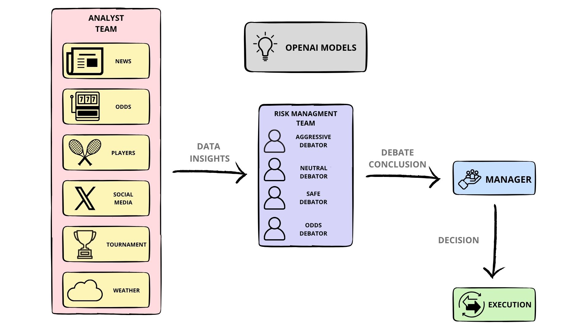
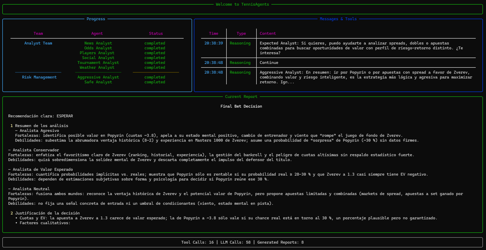

<div align="center">
  <!-- Language translations -->
  <a href="https://www.readme-i18n.com/luispla3/tennisAgents?lang=de">Deutsch</a> | 
  <a href="https://www.readme-i18n.com/luispla3/tennisAgents?lang=es">Español</a> | 
  <a href="https://www.readme-i18n.com/luispla3/tennisAgents?lang=fr">français</a> | 
  <a href="https://www.readme-i18n.com/luispla3/tennisAgents?lang=ja">日本語</a> | 
  <a href="https://www.readme-i18n.com/luispla3/tennisAgents?lang=ko">한국어</a> | 
  <a href="https://www.readme-i18n.com/luispla3/tennisAgents?lang=pt">Português</a> | 
  <a href="https://www.readme-i18n.com/luispla3/tennisAgents?lang=ru">Русский</a> | 
  <a href="https://www.readme-i18n.com/luispla3/tennisAgents?lang=zh">中文</a>
</div>

---

# TennisAgents: Multi-Agents LLM Betting Framework 

## TennisAgents Framework

TennisAgents is a multi-agent betting framework that mirrors the dynamics of professional sports analysis teams. By deploying specialized LLM-powered agents: from player performance analysts, weather experts, odds specialists, and news analysts, to risk management debators, the platform collaboratively evaluates match conditions and informs betting decisions. Moreover, these agents engage in dynamic discussions to pinpoint the optimal betting strategy.

<p align="center">
  
</p>

> TennisAgents framework is designed for research purposes. Betting performance may vary based on many factors, including the chosen backbone language models, model temperature, analysis periods, the quality of data, and other non-deterministic factors. [It is not intended as financial, investment, or gambling advice.]

Our framework decomposes complex tennis match analysis into specialized roles. This ensures the system achieves a robust, scalable approach to match analysis and betting decision-making.

### Analyst Team
- **Players Analyst**: Evaluates player statistics, head-to-head records, current form, and playing style matchups to assess competitive advantages.
- **News Analyst**: Monitors tennis news, injury reports, and player announcements to gauge potential impact on match outcomes.
- **Odds Analyst**: Analyzes betting market movements, value opportunities, and market sentiment to identify profitable betting positions.
- **Tournament Analyst**: Evaluates tournament-specific factors like surface type, altitude, prize money, and historical performance patterns.
- **Weather Analyst**: Assesses weather conditions, court surface interactions, and their impact on different playing styles.
- **Social Media Analyst**: Analyzes social media sentiment, fan engagement, and public perception to gauge momentum and confidence factors.

### Risk Management Team
- **Conservative Debator**: Advocates for cautious betting approaches, emphasizing capital preservation and high-probability outcomes.
- **Aggressive Debator**: Pushes for higher-risk, higher-reward betting opportunities when the analysis supports strong conviction plays.
- **Odds Debator**: Focuses on mathematical expected value calculations and long-term profitability metrics.
- **Neutral Debator**: Provides balanced perspectives and mediates between different risk approaches to find optimal strategies.

### Manager Agent
- Synthesizes reports from all analysts and risk management debators to make final betting decisions. It determines the betting amount, type, and timing based on comprehensive match analysis and risk assessment.

## Installation and CLI

### Installation

Clone TennisAgents:
```bash
git clone https://github.com/luispla3/tennisAgents.git
cd tennisAgents
```

Create a virtual environment:
```bash
conda create -n TennisAgents python=3.13

conda activate TennisAgents
```

Install dependencies:
```bash
pip install -r requirements.txt
```

### Required APIs

You will need the OpenAI API for all the agents:
```bash
# On Linux
export OPENAI_API_KEY=$YOUR_OPENAI_API_KEY
# On Windows
set OPENAI_API_KEY=$YOUR_OPENAI_API_KEY
```

Or create a:
```
.env
```

### CLI Usage

You can try out the CLI directly by running:
```bash
python -m cli.main
```

The CLI will guide you through selecting:
- Players for the match
- Tournament Name
- Match date

## TennisAgents Package

### Implementation Details

We built TennisAgents with a modular architecture to ensure flexibility and scalability. The framework uses advanced LLM models for analysis and decision-making processes.

### Python Usage

To use TennisAgents in your code:

```python
from tennisAgents.graph.trading_graph import TennisAgentsGraph
from tennisAgents.default_config import DEFAULT_CONFIG

ta = TennisAgentsGraph(debug=True, config=DEFAULT_CONFIG.copy())

# Analyze a tennis match
player1 = "Alexander Zverev"
player2 = "Alexei Popyrin"
match_date = "2025-08-05"

_, decision = ta.propagate(player1, player2, match_date)
print(decision)
```

You can also customize the configuration:

```python
from tennisAgents.graph.trading_graph import TennisAgentsGraph
from tennisAgents.default_config import DEFAULT_CONFIG

# Create a custom config
config = DEFAULT_CONFIG.copy()
config["deep_think_llm"] = "o4-mini"
config["quick_think_llm"] = "gpt-4o-mini"
config["max_debate_rounds"] = 3

# Initialize with custom config
ta = TennisAgentsGraph(debug=True, config=config)

# Analyze match
_, decision = ta.propagate(player1, player2, match_date)
print(decision)
```

## Preview

<p align="center">
  
</p>

## Contributing

We welcome contributions from the tennis and AI community! Whether it's improving analysis algorithms, adding new data sources, or enhancing the risk management system, your input helps make this project better.
